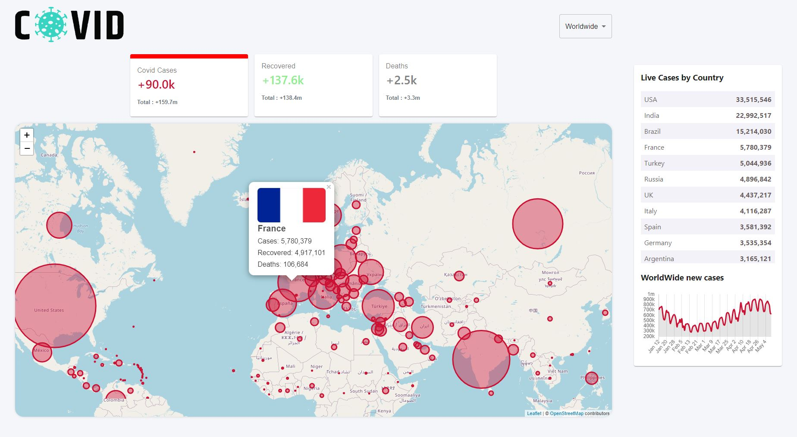

# 🚀 Javascript Front-End 🚀

## Stack :
* React js
* Material UI
* Fetch data from an online API (https://disease.sh/)
* BEM naming convention
* Leaflet (displaying map)
* Chart.js (displaying chart)
_____________________________

### Features :
* Shows Live Cases, Recoveries, Deaths (clickable tabs)
* Shows Worldwide cases and Country Based cases
* Line Chart shows fluctuations over days for Cases, Recoveries, Deaths (Selection with tab)
* Map display Cases, Recoveries, Deaths depending on the tabs selection
* Clickable circle markers on Map show Country stats
* Dropdown field allow us to select a country at this moment the country will be center and zoom on the map, the tabs will display the information for this specified country and the chart will also be updated.
* Responsive
_____________________________

### Quick Started :
Start the app : `npm start`
_____________________________

### Why this project :
I'm learning web development because that interest me. Now this project is created by learning from Clever Programmer (https://www.youtube.com/c/CleverProgrammer/featured) thanks to them for sharing free class on google. 
I choose this project because i want practice Chart.js and Leaflet with a project for be able to display dynamic chart and data on a webpage and also map. 

### What i learn and practice from this project :
  - BEM naming convention and i find this convention really great for when we want to make a new style of a component, we can easily see which modifiers and children already exist. Finally this convention make the process for writting css/html more clean and easier to understand. 
  - Practicing React/javascript/hmtl/css 

### Some reflexion about the project and realtime database :
I think that using redux (store/reducer) will reduce the complexity of the project because the data will be easily available for each component. Otherwise, I already used chart.js without wrapper in another project and I find it more convenient to use it without because it's more flexible. Anyway, I find this project really good to practice react and props because a lot of components communicate with each other using props to share data.

In all cases, I'm now thinking about practicing web development from the courses of the online platform freecodecamps : https://www.freecodecamp.org/learn/ and their different certifications based on concrete projects. I think it could strengthen my bases, and widen my field of vision on this domain and a better understanding. Maybe also Odin project : https://www.theodinproject.com/paths. 

Originally after practicing react I thought I wanted to go deeper. Therefore go on next.js, react-native, electron but finally I think it's better to go on trainings that will give me a more global vision. I think that it will allow me to learn and adapt faster to the evolution in this environment. 

